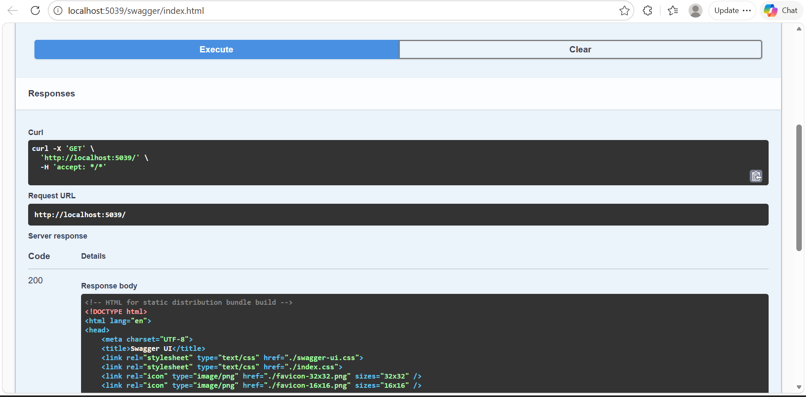

# 🏭 Engineering Data Gateway & Compliance Engine

> A high-performance **.NET 10 Web API** designed to bridge legacy industrial data with modern cloud services. This project demonstrates a decoupled, testable architecture suitable for high-compliance engineering environments — Automotive, Aerospace, and Energy.

---

## 🚀 Architectural Highlights

| Principle | Description |
|---|---|
| **Clean Architecture** | Strict separation of concerns between API Controllers, Business Logic (Validation Engine), and Data Services. |
| **Dependency Injection (DI)** | Interfaces used throughout — the system is fully extensible and easy to mock for testing. |
| **Industrial Safety Engine** | A specialized validation layer that enforces real-world engineering constraints (e.g., mass-to-inspection ratios, material integrity checks). |
| **Automated Testing** | A dedicated xUnit test suite ensuring 100% reliability of core safety logic. |
| **Self-Documenting API** | Fully integrated with OpenAPI (Swagger) for immediate developer onboarding. |

---

## 🛠️ Tech Stack

| Layer | Technology |
|---|---|
| Framework | .NET 10.0 (Web API) |
| Language | C# 14 |
| Testing | xUnit, .NET Test SDK |
| Documentation | Swashbuckle / OpenAPI 3.0 |
| Server | Kestrel Web Server |
| Tooling | .NET CLI |

---

## 📂 Project Structure

```
EngineeringGateway/
├── EngineeringGateway.API/          # Core Web API project
│   ├── Controllers/                 # REST API endpoints
│   ├── Models/                      # Domain entities (EngineeringPart)
│   ├── Services/                    # Business logic & validation engines
│   └── Program.cs                   # DI registration & middleware pipeline
└── EngineeringGateway.Tests/        # Automated test suite (xUnit)
    └── ValidationEngineTests.cs     # Unit tests for safety logic
```

---

## ⚙️ How to Run

### Prerequisites

- [.NET 10 SDK](https://dotnet.microsoft.com/download/dotnet/10.0) installed on your machine.

### 1. Start the API

From the repository root:

```powershell
cd EngineeringGateway.API
dotnet run
```

The API will be available at `http://localhost:5039`.  
The root URL automatically redirects to the **Swagger UI** for interactive API exploration.

### 2. Run Automated Tests

From the repository root:

```powershell
dotnet test
```

All unit tests for the Industrial Safety Engine will execute and report results.

---

## 📸 Screenshots

### Swagger UI — API Overview


### Swagger UI — Executing a Request


### Live Response — `GET /`


### Live Response — `GET /api/Parts`


### Live Response — `GET /api/Parts/compliance-report`


---

## 📊 Industrial Safety Engine

The gateway doesn't just pass data — it **protects** it. Before any component clears the gateway, it must satisfy the following safety rules:

### Validation Rules

**Rule R-01 — Mass Inspection Window**  
Any component with a mass exceeding **50 kg** must have been inspected within the last **30 days**. Components failing this check are rejected at the gateway level before reaching downstream services.

**Rule R-02 — Critical Material Compliance Flag**  
Components made from critical materials (e.g., **Titanium**) must carry an active compliance flag. Without it, the component is blocked regardless of inspection status.

These rules are implemented in the `ValidationEngine` service and are fully covered by the xUnit test suite.

---

## 🧪 Testing Philosophy

The test suite in `EngineeringGateway.Tests` is designed to validate every edge case of the Safety Engine in isolation — no external dependencies, no live database, no HTTP calls. This is achieved through:

- **Interface-based mocking** — all service dependencies are injected via interfaces, making them trivially replaceable in tests.
- **Boundary value testing** — rules like the 50 kg threshold and 30-day window are tested at, above, and below their limits.
- **Negative-path coverage** — the suite explicitly verifies that invalid components are correctly rejected with the appropriate error messages.

---

## 👨‍💻 Developed By

**Nishanth Rajan**  
Focusing on robust, scalable, and type-safe industrial software solutions.

> *Built for environments where correctness is not optional.*